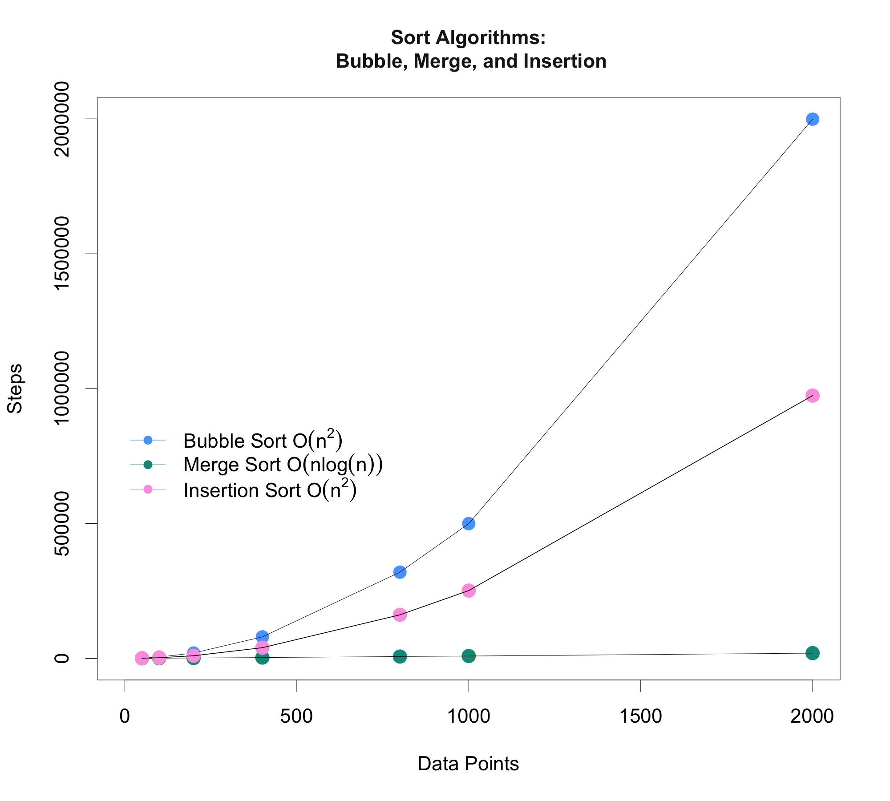

[](https://git.io/gradientbadge)
[](https://git.io/gradientbadge)
[](https://git.io/gradientbadge)


```{r include=FALSE}
library(knitr)
library(graphics)
library(mathjaxr)
library(data.tree)
library(DiagrammeR)
library(kableExtra)
library(rmarkdown)
knitr::opts_chunk$set(echo = TRUE, out.width = 600, eval = FALSE, message = FALSE, warning = FALSE, fig.align = "center")

```


## Insertion Sort

### Background

**Definition.** a Java sorting method where the sorted values locate to the low end of the array, and the unsorted values locate to the high end. There are  passes over the array, with a new unsorted value inserted each time


-  expected running time is ) compares and data movements --most compares will lead to movement of a data value

-  best case running time performance is ) comparisons --occurs for no movements of data within the array

-  therefore, it's best to implement insertion sort on data that is nearly ordered


\ 


#### Show how Insertion Sort acts on the following List: 


```{java}
list X: 7 5 4 6 8 2
```


- Iterate through the array
- Shifting all of the elements to the right until we encounter the first element we don't have to shift
- Place the new element into its proper place within the sorted subarray

\ 


\ 


### Java Methods


#### Method to Insertion Sort a generic type that extends the interface Relateable 


a. create a LinkedList
b. initialize ICount
c. walk down ArrayList and insert each element into sorted LinkedList
d. repackage and return ArrayList
e. method to insert a new element myObj into a sorted LinkedList
    - use a loop to traverse LinkedList
    - begin with first element (smallest T) and find where myObj should go
f. debugging tool and method to dump out content in LinkedList 


\ 


### Code Output

#### Execution Times


At the worst case scenario for the algorithm, the whole array is descending. This is because in each iteration, we'll have to move the whole sorted list by 1, which is ). We have to do this for each element in every array, which means it's going to be bounded by ).


------------------------------------------------


## Bubble Sort 

### Background

**Definition.** Bubble sort checks and rechecks the relation between each component of the list. The method sorts the  elements by linearly moving through the list 

-  where each pass completes  comparisons and  exchanges. 

-  After one pass, the largest integer-value should "bubble" up to the ArrayList's high-indexed side --the operation repeats. 

-  After  passes, the bubble sorting terminates. 

\ 

### Java Methods

#### Bubble Sort Class

i. Method sorts the elements by linearly moving through the list
ii. After a pass, the largest value "bubbles" up the ArrayList
iii. Bubble sorting repeats for (n-1) passes


\ 


### Code Output

#### Execution Times


From the above execution times and graph, we can see that as the number of data points  increases, the number of steps it takes to complete the bubble sort increases **exponentially**. In **big-O notation**, the Simple Bubble Sort Method for sorting  elements of an array is ); hence, the algorithm has a run time that grows quadratically as the input (data points) size grows.


------------------------------------------


## Merge Sort

### Background

**Definition.** MergeSort is a recursive sorting technique that recursively splits, sorts, and reconstructs the data. This method recursively 

-  divides the data into two unsorted lists, 

-  sorts the two lists, 

-  and then merges the two sorted lists. 


\ 

### Java Methods

#### Merge Sort Algorithm

i. Break the whole array down into two subarrays
ii. Sort the left half of the array (recursively)
iii. Sort the right half of the array (recursively)
iv. Merge the solutions


\ 


### Code Output

#### Execution Times


Each value  in the data set must be sorted into a temporary array, allotted once before every single merge; therefore, we have  compares over all the merges. From the above execution times and graph, we can see that as the number of data points  increases, the number of steps it takes to complete the bubble sort increases **logarithmically**. 

In **big-O notation**, since there are  split levels, we have a time execution of ); hence, the search algorithm has a run time that grows logarithmically as the input size grows.


------------------------------------------


## Summary 

### Sorting Techniques: 


From the graph below, we can see that the number of steps to execute the Merge Sort method is significantly lower than the number of steps to execute the Bubble Sort method; hence, the Merge Sort is faster and more efficient than the Bubble Sort. 


```{r include=FALSE}
library(knitr)
library(kableExtra)
library(graphics)
library(datasets)
library(grDevices)
library(drc)

BubbleSort <- data.frame(
  "DataPoints" =c(50, 100, 200, 400, 800, 1000, 2000),
  "Steps" =c(1225, 4950, 19900, 79800, 319600, 499500, 1999000))

fit2 <- lm(BubbleSort$Steps~poly(BubbleSort$DataPoints, 2, raw = TRUE))

quadratic = fit2$coefficient[3]*BubbleSort$DataPoints^2 + 
  fit2$coefficient[2]*BubbleSort$DataPoints +
  fit2$coefficient[1]


jpeg("plot.jpg", quality = 100, height = 1800, width = 2000, res = 100, pointsize = 32, units = "px", type = "quartz")
plot(BubbleSort, pch = 16, cex = 1.5, col = "#57a5ff",main="Sort Algorithms:\n Bubble, Merge, and Insertion", xlab = "Data Points", ylab = "Steps", ylim=c(0,2000000), xlim= c(0, 2000), col.main="gray10", cex.main=1)
par(new = TRUE)
lines(BubbleSort$DataPoints,quadratic, col="black")

datapoints <- c(50, 100, 200, 400, 800, 1000, 2000)
MergeSort <- c(232, 568, 1328, 3037, 6844, 8726, 19425)
InsertionSort <- c(671, 2395, 9743, 39658, 161494, 251346, 974151)

points(datapoints, MergeSort, col="#009987", pch=16, cex=1.6)
lines(datapoints, MergeSort, col="black")

points(datapoints, InsertionSort, col="#fba0e3", pch=16, cex=1.6)
lines(datapoints, InsertionSort, col="black", lwd=1.6)

legend(x=0,y=900000,legend=c(expression(
  "Bubble Sort O" * (n^2),
  "Merge Sort O" * (n*log(n)),
  "Insertion Sort O" * (n^2))),
  col=c("#57a5ff","#009987", "#fba0e3"),
  pch=c(16,16,16),lty=c(1,1,1), ncol=1,
  bty = "n", cex = 1 )
dev.off()
```


```{r echo=FALSE, eval=TRUE}

```


------------------------------------------


